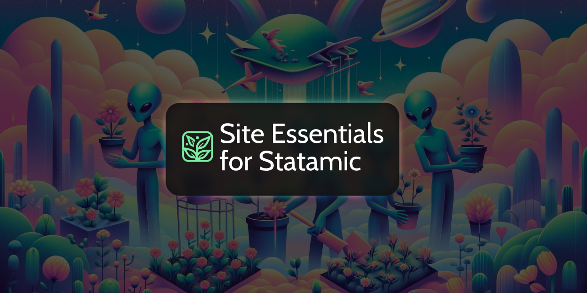

Site Essentials for Statamic is a Statamic addon that aims to make it simpler to rapidly develop websites.

* **Handfuls of Antlers tags and modifiers**: Site Essentials ships with many different types of Antlers tags and modifiers. Examples include capturing sections of a template to be emitted later, creating unique IDs for HTML elements, and a whole lot more.
* **Dedicated Front-end Asset Management**: Site Essentials ship with dedicated front-end asset queues, which can help to include arbitrary scripts and styles on a page. This feature behaves similarly to manually crafted sections, but with a friendlier development experience.
* **Favicon Generation**: Site Essentials provides a system for generating a configurable number of favicons from Assets or other, arbitrary image sources.
* **Web Manifest Generation**: Generate `site.webmanifest` files (using a PHP configuration file as the source-of-truth). This feature also integrates with the favicon generator, simplifying things even more.
* **Metadata Manager**: An incredibly robust framework for managing a site's `<meta />` and `<link />` tags. Site Essentials ships with support for Open Graph, X/Twitter, most link/meta tags, but also allows for custom meta tags to be registered. Metadata is managed in PHP code, and can be emitted with a single Antlers tag. <small>The metadata manager can integrate with existing SEO addons, offering the best of all worlds.</small>

## Installation and Documentation

Site Essentials for Statamic documentation can be found online at https://stillat.com/site-essentials-for-statamic/v1/introduction-installation

## License

This software is released under the GLP-3.0 license. Please see the [LICENSE](LICENSE.md) file for more information.
